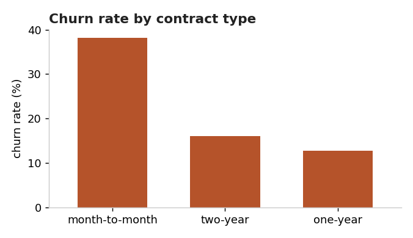
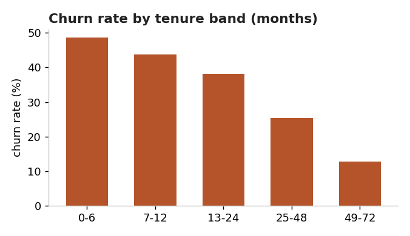
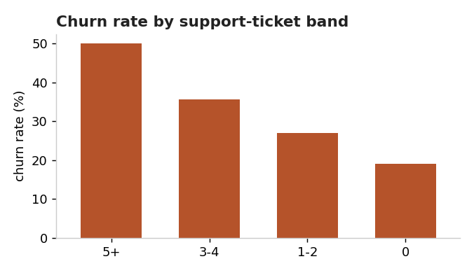
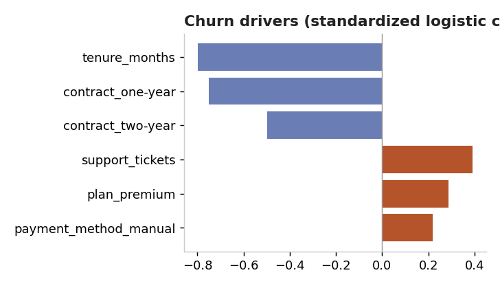

# Why are customers leaving, and what should we do about it?

A churn analysis that goes from a flat subscription table to a single, costed recommendation. The point of this write-up is not the model. It is the decision the model supports.

> Data note: the dataset here is synthetic and generated locally (`generate_data.py`) so the analysis is fully reproducible offline. The method, the framing, and the charts transfer directly to a real dataset: drop your own CSV with the same columns into `data/` and re-run `analyze.py`.

## 1. The question

Leadership sees revenue leaking but cannot say *who* is leaving or *why*. The business question:

> Which customers are most likely to churn, what is driving it, and where should a small retention budget be spent first?

## 2. The data

2,000 subscriptions, one row per customer: contract type, plan, payment method, tenure, support tickets, monthly charges, and whether they churned. **Overall churn rate: 27.2%.** That is the number to beat.

## 3. What the segments say

| Cut | Highest-risk group | Churn | Lowest-risk group | Churn |
| --- | --- | --- | --- | --- |
| Contract | Month-to-month | **38.1%** | One-year | 12.8% |
| Tenure | 0 to 6 months | **48.6%** | 49 to 72 months | 12.7% |
| Support tickets | 5 or more | **50.0%** | 0 tickets | 19.0% |
| Payment | Manual | 31.6% | Automatic | 24.4% |

Three signals dominate: **short tenure, month-to-month contracts, and a rising support-ticket count.** Churn is front-loaded into the first year and climbs steeply with support friction.





## 4. Confirming it with a model

Segment rates can mislead when variables move together (short-tenure customers are also more often month-to-month). To isolate each effect I fit a logistic regression from scratch in NumPy on standardized features.

- **Validation: AUC 0.778, accuracy 76.4%.** Good enough to rank risk, which is all the decision needs.
- **Standardized drivers** (larger absolute value = stronger independent effect):



Low tenure and short contracts are the strongest protective-when-present / risky-when-absent factors, with support tickets the leading *behavioural* warning sign. This matches the segment view, so the story holds up under scrutiny.

## 5. From insight to money

A driver list is not yet a decision. I intersected the three strongest risk signals into one actionable segment:

> **Month-to-month, tenure 12 months or less, 3 or more support tickets.**

- **41 customers**, churning at **73.2%** (versus 27.2% baseline).
- **$1,601 in monthly recurring revenue at risk, roughly $19,200 ARR**, concentrated in a group small enough for a human to actually work.

## 6. Recommendation

1. **Trigger a proactive save play** the moment a customer hits 3 support tickets inside their first year on a month-to-month plan: a success-team outreach plus an incentive to move to an annual contract (annual churn is 12.8% versus 38.1%).
2. **Fix the support driver upstream.** Tickets are the controllable signal; reducing repeat contacts attacks churn at its source rather than buying it back later.
3. **Measure against the 27.2% baseline** with a holdout group so the intervention's effect is provable, not assumed.

## 7. Honest caveats

- The dataset is synthetic, so the exact percentages are illustrative; the workflow, not the numbers, is the deliverable.
- Logistic regression shows association, not proof of cause; the recommendation is framed as a test with a holdout, not a guarantee.
- A real engagement would add cohort-over-time retention curves and the cost of the incentive to compute true ROI.

## Reproduce

```bash
python3 generate_data.py   # or drop your own data/subscriptions.csv
python3 analyze.py         # prints findings, writes charts/ and findings.json
```
